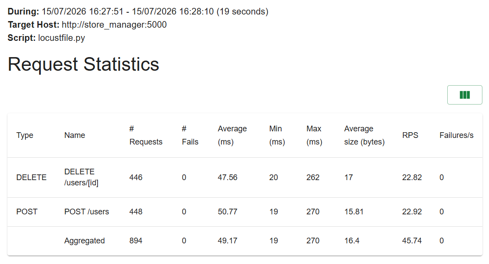

ÉTS - LOG430 - Architecture logicielle - Été 2026
Étudiant(e) : Joshua-Nicolas Pierre
# Questions
## 1 : 
Dans le labo 5, la communication avec payments_api est principalement
synchrone et de type requête-réponse. Le client appelle un endpoint exposé
par KrakenD, puis la passerelle transmet directement la requête HTTP au service
de paiement :

```json
{
  "endpoint": "/payments-api/payments",
  "method": "POST",
  "backend": [{
    "url_pattern": "/payments",
    "host": ["http://payments_api:5009"]
  }]
}
```

Le client attend donc la réponse de la passerelle et de payments_api. Les
services connaissent leurs interfaces HTTP et la disponibilité du service de
paiement influence immédiatement le résultat de la requête.

Dans le labo 7, la communication entre store_manager et coolriel est
asynchrone et passe par Kafka. Après l'enregistrement de l'utilisateur,
store_manager publie un événement sans appeler Coolriel directement :

```python
UserEventProducer().get_instance().send(
    "user-events",
    value={
        "event": "UserCreated",
        "id": new_user.id,
        "name": new_user.name,
        "email": new_user.email,
        "datetime": str(datetime.datetime.now()),
    },
)
```

Le consommateur Coolriel lit le topic, récupère le type de l'événement, puis
sélectionne le handler correspondant dans son registre :

```python
event_type = event_data.get("event")
handler = self.registry.get_handler(event_type)
if handler:
    handler.handle(event_data)
```

```mermaid
flowchart LR
    subgraph Labo 5 — synchrone
        C1[Client] -->|HTTP| G[KrakenD]
        G -->|HTTP POST| P[payments_api]
        P -->|Réponse immédiate| G
        G --> C1
    end

    subgraph Labo 7 — asynchrone
        C2[Client] -->|HTTP POST /users| S[store_manager]
        S -->|Publie UserCreated| K[(Kafka: user-events)]
        K -->|Consomme| E[coolriel]
        E --> H[Fichier HTML]
    end
```

### Avantages et inconvénients

| Approche | Avantages | Inconvénients |
|---|---|---|
| HTTP synchrone | Flux simple à suivre; réponse immédiate; erreurs visibles par l'appelant | Couplage temporel et contractuel; latence cumulée; indisponibilité propagée; mise à l'échelle moins souple |
| Kafka asynchrone | Producteur et consommateur découplés; absorption des pointes; ajout de nouveaux consommateurs sans modifier le producteur; possibilité de rejouer l'historique | Cohérence éventuelle; exploitation de Kafka plus complexe; erreurs asynchrones moins visibles; gestion des doublons, offsets et schémas nécessaire |

Le test d'intégration du setup a créé l'utilisateur 4. L'API a répondu
{"user_id": 4} et Coolriel a ensuite généré le fichier
output/welcome_4.html. Cela confirme que la réponse HTTP du Store Manager et
la production du courriel sont deux traitements séparés par le broker Kafka.

## 2:

Les deux méthodes de src/orders/commands/write_user.py ont été modifiées :
add_user et delete_user.

### Ajout d'un utilisateur

add_user reçoit maintenant user_type_id, vérifie qu'il correspond à l'un
des trois types permis, puis l'enregistre dans MySQL :

```python
def add_user(name: str, email: str, user_type_id: int):
    if not name or not email or user_type_id is None:
        raise ValueError(
            "Cannot create user. A user must have name, email and user_type_id."
        )

    user_type_id = int(user_type_id)
    if user_type_id not in {1, 2, 3}:
        raise ValueError(
            "user_type_id must be 1 (Client), 2 (Employee) or 3 (Manager)."
        )

    new_user = User(
        name=name,
        email=email,
        user_type_id=user_type_id,
    )
```

Le champ est également inclus dans l'événement `UserCreated`, afin que les
consommateurs puissent personnaliser leurs traitements sans interroger la base
de données du Store Manager :

```python
{
    "event": "UserCreated",
    "id": new_user.id,
    "name": new_user.name,
    "email": new_user.email,
    "user_type_id": new_user.user_type_id,
    "datetime": str(datetime.datetime.now()),
}
```

### Suppression d'un utilisateur

delete_user copie le type et les autres données avant le DELETE, puis les
publie dans l'événement UserDeleted après la transaction :

```python
event_data = {
    "event": "UserDeleted",
    "id": user.id,
    "name": user.name,
    "email": user.email,
    "user_type_id": user.user_type_id,
    "datetime": str(datetime.datetime.now()),
}
session.delete(user)
session.commit()
UserEventProducer().get_instance().send("user-events", value=event_data)
```

Pour acheminer la valeur jusqu'à ces méthodes, le contrôleur lit maintenant
payload.get("user_type_id"). Le modèle SQLAlchemy contient la propriété
user_type_id et une clé étrangère vers la table user_types. La requête de
lecture retourne aussi ce champ.

### Résultats observés

Après la recréation du volume MySQL, les données initiales et les trois créations
de test ont retourné :

```text
SEED 4 {"email":"jdoe@magasinducoin.ca","id":4,"name":"Jane Doe","user_type_id":2}
SEED 5 {"email":"dboss@magasinducoin.ca","id":5,"name":"Da Boss","user_type_id":3}
CREATED {"id":6,"name":"Client Test","user_type_id":1,...}
CREATED {"id":7,"name":"Employee Test","user_type_id":2,...}
CREATED {"id":8,"name":"Manager Test","user_type_id":3,...}
```

## 3 :

Le Store Manager inclut user_type_id dans les événements UserCreated et
UserDeleted. Coolriel n'a donc pas besoin d'accéder à la base de données d'un
autre microservice pour connaître le type de l'utilisateur.

Chaque handler possède une correspondance explicite entre l'identifiant du type
et le template HTML à utiliser. Pour la création :

```python
TEMPLATE_BY_USER_TYPE = {
    1: "welcome_client_template.html",
    2: "welcome_employee_template.html",
    3: "welcome_manager_template.html",
}

user_type_id = int(event_data.get("user_type_id", 1))
template_name = self.TEMPLATE_BY_USER_TYPE.get(
    user_type_id,
    self.TEMPLATE_BY_USER_TYPE[1],
)
```

Le handler de suppression applique le même principe avec
goodbye_client_template.html, goodbye_employee_template.html et
goodbye_manager_template.html. La valeur par défaut 1 préserve la
compatibilité avec les anciens événements Kafka qui ne contiennent pas encore
user_type_id. Un identifiant inconnu utilise également le template client.

Les messages principaux sont notamment :

| Type | Bienvenue | Départ |
|---|---|---|
| Client (`1`) | Remerciement pour la visite du magasin | Remerciement pour avoir été client |
| Employé (`2`) | « Salut et bienvenue dans l'équipe ! » | Remerciement pour le travail dans l'équipe |
| Directeur (`3`) | Bienvenue dans l'équipe de direction | Remerciement pour le leadership |

### Résultats observés

Les tests unitaires couvrent les trois types pour les deux handlers et donnent
8 passed. Un test d'intégration a ensuite créé et supprimé trois utilisateurs
par le Store Manager. Kafka et Coolriel ont produit les résultats suivants :

```text
WELCOME type=1 id=10 personalized=True
WELCOME type=2 id=11 personalized=True
WELCOME type=3 id=12 personalized=True
GOODBYE type=1 id=10 personalized=True
GOODBYE type=2 id=11 personalized=True
GOODBYE type=3 id=12 personalized=True
```

Les fichiers correspondants sont enregistrés dans output/ sous les noms
welcome_10.html à welcome_12.html et goodbye_10.html à
goodbye_12.html.

## 4:

Un topic Kafka est divisé en partitions. Chaque partition est un journal
immuable auquel les événements sont ajoutés séquentiellement. Chaque événement
reçoit un offset qui l'identifie de façon unique à l'intérieur de sa partition.

Le partitionnement améliore les performances et la capacité de lecture de
plusieurs façons :

1. Les partitions d'un topic peuvent être distribuées sur plusieurs brokers.
   Les lectures ne sont donc pas limitées aux ressources d'un seul serveur.
2. Dans un groupe de consommateurs, Kafka attribue chaque partition à un seul
   consommateur à la fois. Plusieurs consommateurs peuvent ainsi lire des
   partitions différentes en parallèle sans se disputer le même journal.
3. L'ajout ou le retrait d'un consommateur déclenche une nouvelle répartition
   des partitions entre les membres du groupe. La charge peut donc être
   rééquilibrée automatiquement.
4. Un producteur peut distribuer les événements entre les partitions pour
   équilibrer la charge, ou choisir une partition à partir d'une clé afin de
   conserver ensemble les événements liés à une même entité.
5. L'ordre est garanti à l'intérieur d'une partition, mais pas entre les
   différentes partitions d'un topic. Cette garantie locale permet de conserver
   le parallélisme. Un ordre total exige une seule partition et limite alors un
   groupe à un seul consommateur actif.

Le nombre de partitions constitue donc la limite supérieure du parallélisme de
lecture utile dans un groupe. Avec quatre partitions, jusqu'à quatre
consommateurs du même groupe peuvent travailler simultanément; un cinquième
reste sans partition. Plusieurs groupes distincts peuvent néanmoins relire les
mêmes événements indépendamment.

Ces éléments proviennent de la section « Topics and Logs », « Distribution » et
« Consumers » de la
[documentation officielle Apache Kafka 2.4](https://kafka.apache.org/24/getting-started/introduction/).

### Configuration et observations du laboratoire

La configuration appliquée au broker est :

```yaml
KAFKA_LOG_RETENTION_HOURS: 168
KAFKA_LOG_RETENTION_BYTES: 1073741824
KAFKA_LOG_SEGMENT_BYTES: 214748364
```

Les valeurs effectives retournées par le broker correspondent à ces trois
valeurs. Après la création et la suppression des utilisateurs 13 et 14, les
offsets observés étaient :

```text
EARLIEST user-events:0:0
LATEST   user-events:0:17
```

Le topic du laboratoire ne possède actuellement qu'une partition, la partition
0. Les 17 événements sont conservés, mais un seul consommateur d'un même
groupe peut lire cette partition à la fois. L'ajout de partitions permettrait
une lecture parallèle, au prix de l'absence d'ordre total entre partitions.

## 5:

Le consommateur historique est lancé avant le consommateur temps réel avec un
identifiant de groupe distinct :

```python
consumer_service_history = UserEventHistoryConsumer(
    bootstrap_servers=config.KAFKA_HOST,
    topic=config.KAFKA_TOPIC,
    group_id=f"{config.KAFKA_GROUP_ID}-history",
    registry=registry,
    output_dir=config.OUTPUT_DIR,
    consumer_timeout_ms=5000,
)
history_count = consumer_service_history.start()
logger.info(f"Événements historiques récupérés : {history_count}")
```

Le consommateur utilise auto_offset_reset="earliest" et désactive
l'auto-commit. Il accumule les événements en mémoire, appelle json.dumps une
seule fois, puis écrit le résultat dans
output/user_event_history.json. Cela évite une opération d'entrée/sortie à
chaque itération.

Au démarrage vérifié pendant le laboratoire, 17 événements ont été
récupérés :

- 10 événements UserCreated;
- 7 événements UserDeleted.

Le premier et le dernier objet du fichier étaient :

```json
[
  {
    "event": "UserCreated",
    "id": 4,
    "name": "Setup Verification",
    "email": "setup.1784141912@example.com",
    "datetime": "2026-07-15 18:58:32.496006"
  },
  {
    "event": "UserDeleted",
    "id": 14,
    "name": "Retention Manager",
    "email": "retention.manager.1784146098@example.com",
    "user_type_id": 3,
    "datetime": "2026-07-15 20:08:18.645638"
  }
]
```

Cet extrait montre seulement les bornes du fichier; le fichier généré contient
bien les 17 objets. Après le timeout historique, un test supplémentaire avec
l'utilisateur 15 a confirmé que le consommateur temps réel avait démarré :

```text
LIVE_CONSUMER_OK user_id=15 welcome=True goodbye=True
```

## 8:

Le test de charge a été exécuté avec Locust directement contre le service
Store Manager. Chaque utilisateur virtuel crée un utilisateur avec une adresse
courriel unique et un type choisi aléatoirement, puis supprime cet utilisateur.
Cette séquence déclenche donc des événements `UserCreated` et `UserDeleted` dans
Kafka.

La configuration utilisée était la suivante :

- hôte : http://store_manager:5000;
- 10 utilisateurs virtuels;
- taux de démarrage : 2 utilisateurs par seconde;
- durée : 20 secondes;
- délai entre les séquences : de 0,1 à 0,5 seconde.

La commande exécutée était :

```bash
docker compose run --rm --no-deps locust \
  -f /mnt/locust/locustfile.py \
  --host=http://store_manager:5000 \
  --headless --users 10 --spawn-rate 2 --run-time 20s \
  --csv=/mnt/locust/labo7_results \
  --html=/mnt/locust/labo7_results.html
```

### Résultats

| Requête | Nombre | Échecs | Moyenne | Médiane | Minimum | Maximum | 95e percentile | Requêtes/s |
|---|---:|---:|---:|---:|---:|---:|---:|---:|
| `POST /users` | 448 | 0 | 50 ms | 40 ms | 18 ms | 269 ms | 110 ms | 22,92 |
| `DELETE /users/[id]` | 446 | 0 | 47 ms | 39 ms | 19 ms | 261 ms | 97 ms | 22,82 |
| **Total** | **894** | **0** | **49 ms** | **40 ms** | **18 ms** | **269 ms** | **110 ms** | **45,74** |

Le 99e percentile global était de 210 ms. Le test n'a produit aucune erreur
HTTP. Les créations sont légèrement plus lentes que les suppressions, mais la
différence demeure faible. Le débit global a atteint 45,74 requêtes par
seconde, avec une latence moyenne de 49 ms.

Les deux créations de plus que les suppressions ne représentent pas des
échecs : le test s'est arrêté pendant que deux utilisateurs virtuels se
trouvaient entre les deux appels de leur séquence. Locust n'a signalé aucun
échec de requête.

Après le test, le groupe de consommateurs Coolriel avait traité l'ensemble des
événements disponibles :

```text
CURRENT-OFFSET  LOG-END-OFFSET  LAG
913             913             0
```

Le retard nul montre que Coolriel a rattrapé le flux produit par cette charge.
Comme la génération des courriels passe par Kafka de façon asynchrone, elle ne
bloque pas les réponses HTTP du Store Manager. Ces résultats décrivent une
charge modérée dans l'environnement Docker local; ils ne remplacent pas un test
de capacité prolongé ou distribué.



Le rapport HTML complet et les fichiers CSV produits par Locust sont conservés
dans docs/load-test/ comme preuves reproductibles du test.
